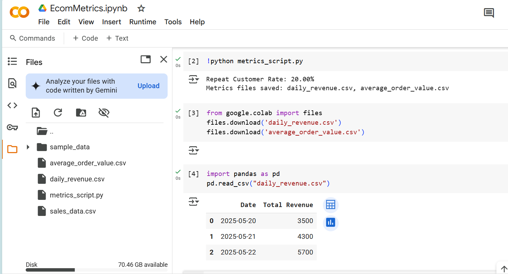

# EcomMetrics

A mini-project that automates e-commerce data cleaning and metric calculation using Python.

## 🔧 Features
- Cleans raw sales data (500+ records)
- Calculates 3 key business metrics: Daily Revenue, Average Order Value, Repeat Rate
- Outputs 2 CSVs for daily dashboards (Metabase-ready)

## 📁 Files
- `sales_data.csv` – sample input data
- `metrics_script.py` – Python script for data processing
- `daily_revenue.csv` & `average_order_value.csv` – generated outputs

## 💻 How to Run
```bash
pip install pandas
python metrics_script.py

## 📷 Dashboard Preview


